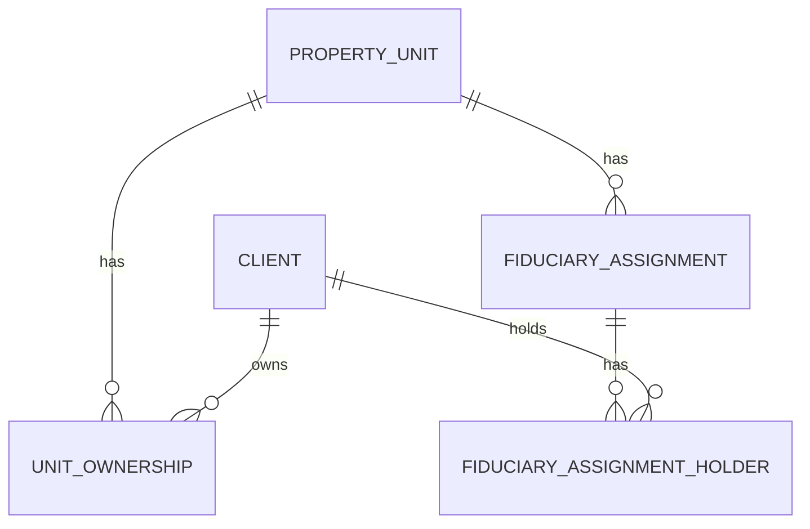

# Modelo tecnico de clientes, titularidades y encargos

## App

La Fase 3 incorpora la app `fiduciary` para concentrar clientes, titularidades y encargos fiduciarios. Se mantiene una sola app porque estas entidades forman un nucleo funcional con relaciones directas entre si.

No incluye pagos, importaciones, cartera, novedades completas, auditoria funcional, API ni integraciones externas.

## Entidades

### Client

Representa una persona natural o empresa identificada como cliente o titular.

Campos principales:

- `document_type`: tipo de documento controlado por `TextChoices` (`cc`, `ce`, `passport`, `nit`).
- `document_number`: numero de documento normalizado con `strip()`. Puede ser nulo solo para registros incompletos creados por importacion.
- `first_names`: nombres, opcional para empresas.
- `last_names_or_company`: apellidos o razon social.
- `phone`, `email`, `address`: medios de contacto.
- `information_status`: `complete` o `incomplete`.
- `incomplete_reason`: motivo sanitizado cuando la informacion es incompleta.
- `source_origin`: origen del registro (`manual`, `historical_import`, `report_import`).
- `is_active`: activo/inactivo.
- `last_change_reason`, `created_at`, `updated_at`.

Reglas:

- La combinacion `document_type` + `document_number` identifica al cliente solo cuando existe numero de documento.
- Un cliente completo creado manualmente debe tener al menos telefono o correo electronico.
- Los formularios manuales exigen tipo y numero de documento, y no permiten `UNKNOWN`.
- Los servicios de importacion pueden crear clientes incompletos con tipo `UNKNOWN` y sin numero de documento.
- Los clientes sin documento no se fusionan automaticamente por similitud de nombre.
- La direccion puede almacenarse, pero no cuenta como medio de contacto suficiente para guardar un cliente manual.
- Los clientes manuales se crean como completos.
- Un cliente inactivo no se elimina ni pierde relaciones historicas.

### UnitOwnership

Relacion historica entre `Client` y `PropertyUnit`.

Campos principales:

- `client`.
- `property_unit`.
- `is_primary`.
- `start_date`.
- `end_date`.
- `is_active`.
- `last_change_reason`, `created_at`, `updated_at`.

Reglas:

- Una unidad puede tener varios titulares.
- Solo puede existir un titular principal vigente por unidad.
- Un cliente no puede tener dos titularidades vigentes simultaneas sobre la misma unidad.
- Las titularidades anteriores se conservan.
- Fecha final no puede ser anterior a fecha inicial.
- Vigente implica ausencia de fecha final.
- Finalizada implica fecha final.
- No se asignan clientes inactivos ni unidades inactivas a titularidades vigentes manuales.

### FiduciaryAssignment

Representa un encargo fiduciario asociado a una unica unidad inmobiliaria.

Campos principales:

- `assignment_number`: numero asignado por fiducia.
- `property_unit`.
- `start_date`.
- `end_date`.
- `is_active`.
- `observations`.
- `last_change_reason`, `created_at`, `updated_at`.

Reglas:

- Una unidad puede tener varios encargos historicos.
- Solo puede existir un encargo vigente por unidad.
- Los encargos anteriores se conservan.
- Un encargo vigente debe tener titular principal vigente.
- No se almacenan pagos ni valores temporales.
- La creacion manual de encargos existe temporalmente solo para validaciones de Fase 3. En el flujo funcional definitivo, los encargos provienen del libro inicial o de archivos/reportes suministrados por la fiduciaria.

### FiduciaryAssignmentHolder

Relacion explicita entre un encargo fiduciario y sus titulares.

Campos principales:

- `assignment`.
- `client`.
- `is_primary`.
- `start_date`.
- `end_date`.
- `is_active`.
- `last_change_reason`, `created_at`, `updated_at`.

Reglas:

- Un encargo vigente debe tener exactamente un titular principal vigente.
- Puede tener varios titulares secundarios vigentes.
- El titular del encargo debe tener titularidad vigente sobre la misma unidad.
- No puede haber dos relaciones vigentes identicas cliente-encargo.

## Cardinalidades

- `Client` 1 a N `UnitOwnership`.
- `PropertyUnit` 1 a N `UnitOwnership`.
- `PropertyUnit` 1 a N `FiduciaryAssignment`.
- `FiduciaryAssignment` 1 a N `FiduciaryAssignmentHolder`.
- `Client` 1 a N `FiduciaryAssignmentHolder`.

## Constraints de PostgreSQL

- `fiduciary_client_document_unique`: documento unico por tipo y numero solo cuando existe numero real.
- `fiduciary_client_information_status_valid`: estados de informacion validos.
- `fiduciary_client_source_origin_valid`: origenes de registro validos.
- `fiduciary_unit_one_active_primary_owner`: maximo un titular principal vigente por unidad.
- `fiduciary_unit_active_client_unique`: maximo una titularidad vigente cliente-unidad.
- `fiduciary_assignment_one_active_per_unit`: maximo un encargo vigente por unidad.
- `fiduciary_assignment_one_active_primary_holder`: maximo un titular principal vigente por encargo.
- `fiduciary_assignment_active_client_unique`: maximo una relacion vigente cliente-encargo.

## Infraestructura de importacion

La Fase 4A incorpora modelos base para soportar libros historicos y reportes fiduciarios sin implementar todavia lectura de Excel, matching, previsualizacion ni interfaz de importacion.

### ImportBatch

Representa una operacion de importacion iniciada por un usuario. Registra tipo (`historical`, `reports`), modo (`single_file`, `folder`), estado, fechas de procesamiento, conteos generales y resumen sanitizado.

### ImportedFile

Representa cada archivo dentro de un lote. Registra nombre original, extension, tamano, SHA-256, tipo, estado, orden, conteos y mensaje sanitizado. No almacena ruta local ni contenido del archivo. La unicidad `batch` + `sha256` evita repetir el mismo archivo dentro de un lote; la deteccion historica global queda para servicio de importacion.

### ImportedSheetResult

Registra el resultado por hoja: nombre, orden, visibilidad, clasificacion, fila de encabezado, dimension, conteos, estado y resumen sanitizado.

### ImportRowIssue

Registra incidencias tecnicas o de validacion por archivo, hoja, fila y columna, usando severidad, codigo estable, mensaje sanitizado y estado. No debe almacenar documentos completos, telefonos, correos, nombres completos ni valores financieros innecesarios.

### DetectedStructureElement e ImportResolution

`DetectedStructureElement` conserva valores estructurales detectados antes de persistirlos. `ImportResolution` guarda la decision asistida o automatica asociada al valor detectado sin usar `GenericForeignKey`; utiliza relaciones explicitas opcionales a proyectos, tipos, agrupaciones y unidades.

### ImportNovelty

Registra novedades funcionales detectadas, como cesiones, traslados, retiros, titulares ambiguos o estructura incompatible. No sustituye incidencias tecnicas ni resoluciones temporales.

## Pagos

### Payment

Representa un movimiento economico importado y se relaciona principalmente con `FiduciaryAssignment`. No almacena cliente pagador ni unidad como campo obligatorio porque el encargo conduce a la unidad, titulares, agrupacion y proyecto.

Campos principales:

- `assignment`.
- `exact_date`, para reportes con fecha exacta.
- `period_year` y `period_month`, para pagos historicos mensuales sin dia.
- `date_precision`: `exact` o `month`.
- `amount`: `DecimalField(max_digits=18, decimal_places=2)`.
- `concept`: opcional.
- `movement_type`: `historical_payment`, `addition`, `withdrawal`.
- `source_file`, `source_sheet`, `source_row`, `source_column`, `source_header`.
- `source_had_formula`.
- `imported_at`, `created_at`, `updated_at`.

Reglas:

- Debe existir exactamente una modalidad de fecha.
- Pagos con fecha exacta no tienen periodo mensual.
- Pagos mensuales no inventan un dia.
- El valor debe ser mayor que cero.
- Los retiros se modelan con valor positivo y `movement_type = withdrawal`.
- El concepto no participa en la deduplicacion.

Deduplicacion:

- Fecha exacta: `assignment` + `exact_date` + `amount`.
- Periodo mensual: `assignment` + `period_year` + `period_month` + `amount`.

La proteccion existe en servicio y en constraints condicionales de PostgreSQL.

## Permisos

Contabilidad y superusuarios tecnicos:

- Consultar, crear, editar, activar/inactivar clientes.
- Consultar, crear y finalizar titularidades.
- Consultar, crear, editar y cerrar encargos.
- Administrar titulares asociados a encargos.

Comercial:

- Consultar clientes.
- Consultar titularidades.
- Consultar encargos fiduciarios.
- Consultar unidades.

Comercial no puede ejecutar operaciones manuales de escritura. Las restricciones se aplican en servidor.

## Operaciones atomicas

Se usa `transaction.atomic()` en operaciones que modifican una o varias entidades:

- Crear clientes.
- Editar clientes.
- Activar/inactivar clientes.
- Crear/finalizar titularidades.
- Crear encargos con titulares.
- Editar/cerrar encargos.
- Agregar/finalizar titulares de encargos.

## Preparacion para fases posteriores

El modelo conserva historicos de titularidades y encargos, permitiendo representar posteriormente cesiones, cambios de unidad, cambios de titular principal y cambios de encargo sin sobrescribir informacion previa.

Desde Fase 4A existe el modelo `Payment` relacionado con `FiduciaryAssignment`, pero todavia no existe lectura de archivos ni importador historico. Las pantallas funcionales de pagos y reportes pertenecen a fases posteriores.

El formulario manual de creacion de encargos queda marcado en la interfaz como herramienta temporal de validacion. Debe retirarse o bloquearse cuando se implemente la carga oficial de encargos desde archivos.

## Decision pendiente

La documentacion revisada no define si `assignment_number` debe ser unico globalmente, unico por proyecto o unico por unidad. Por esa razon la Fase 3 no implementa un constraint de unicidad sobre el numero de encargo.

## Diagrama textual



## Pruebas

Validacion oficial:

```powershell
.\.venv\Scripts\python manage.py check
.\.venv\Scripts\python manage.py makemigrations --check --dry-run
.\.venv\Scripts\python manage.py migrate
.\.venv\Scripts\pytest --ds=config.settings
```
